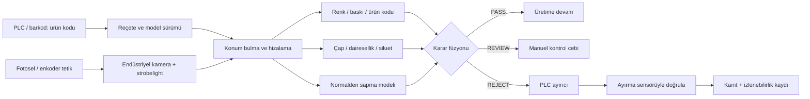

# Ürün koduna göre makara kalite kontrolü — hazır repo ve endüstriyel çözüm araştırması

**Tarih:** 2026-09-02 · **Repo HEAD:** `c259e45` · **Sınıf:** research · **Risk:** auto (yalnız araştırma; uygulama kodu değişmedi)

## TL;DR

Sorulan sistem, ürün koduna göre doğru makara reçetesini seçip yanlış renk/şekil, eksik parça ve fiziksel bozukluğu hat üzerinde bulmalı ve hatalı ürünü ayırmalıdır. Bu iş mevcut AurasVision'ın sürekli RTSP akışında kişi/araç olayı üretmesinden farklıdır: sabit ve kontrollü görüntüleme, donanım tetiklemesi, ürün başına reçete, hibrit kural + anomali denetimi ve PLC üzerinden izlenebilir ayırma gerekir. Öneri, açık kaynak POC'ta **Anomalib çekirdeğini** AurasVision olay/kanıt altyapısına bağlamak; aynı gerçek veri setini **MVTec MERLIC veya Cognex In-Sight** üzerinde çalıştırarak satın alma–geliştirme kararını ölçmektir.

## 1. Sorunun doğru teknik sınıfı

Bu bir “genel kamera analitiği” değil, **inline machine-vision inspection** işidir. Her fiziksel ürün için deterministik zincir şöyledir: ürün kodu/reçete → sensör tetiklemesi → kontrollü pozlama → konum düzeltme → renk/ölçü/kod/anomali denetimi → `PASS | REVIEW | REJECT` → PLC ayırma → ayırmanın ikinci sensörle doğrulanması. Basler'ın resmi dokümanı da konveyör denetiminde sensör/PLC/enkoderle donanım tetiklemesini, her parçayı aynı fiziksel anda ve tekrarlanabilir biçimde yakalamak için önerir (https://docs.baslerweb.com/pypylon-triggered-image-acquisition, erişim: 2026-09-02). — `doğrulanmış`

Tek bir “doğru fotoğraf” üretim reçetesi için yeterli değildir. Kabul edilebilir konum, iplik dokusu, karton tonu ve aydınlatma varyasyonları bir örnek kümesiyle temsil edilmelidir; LandingLens kendi anomali iş akışında başlangıç noktası olarak 50 normal görüntü, eşik ayarı için en az 1 ve tercihen 10+ anormal görüntü önerir, ayrıca arka planın sabit tutulmasını şart koşar (https://landinglens.docs.landing.ai/anomaly-detection, erişim: 2026-09-02). Bu sayılar garanti değil, veri toplama için üretici kılavuzudur. — `ikincil`

Makara silindirik olduğundan görüş kapsamı açıkça tanımlanmalıdır. Yalnız masura ağzı/rengi ve ön yüz kontrol edilecekse karşıdan bir renkli area-scan kamera yeterli olabilir; tüm çevre ve baskı kontrol edilecekse ürün döndürülmeli veya çok kameralı/line-scan düzenek kurulmalıdır. Cognex'in resmi kılavuzu silindirik parçaların farklı açılardaki kusurlarını görmek için döndürülerek çoklu görüntü alınmasını söyler; 9902L line-scan ürününü de büyük, silindirik veya sürekli hareketli nesneler için konumlandırır (https://docs.cognex.com/deep-learning_321/web/EN/deep-learning/Content/deep-learning-Topics/guidelines/tool-chain.htm; https://www.cognex.com/en-il/products/machine-vision/2d-machine-vision-systems/in-sight-9000-series/resources, erişim: 2026-09-02). — `doğrulanmış`

## 2. Neden mevcut AurasVision hattından ayrı bir çalışma modu olmalı?

Mevcut üretim mimarisi sürekli kamera akışını NVDEC ile çözüp hareket filtresi, batch YOLO ve takip üzerinden olay üretir (`docs/mimari-100-kamera.md:57-62 @c259e45`). `gpu_engine` yalnız sayım/plaka/yüz görevi açık kameraları işleme alır ve görünüm vektörlerini yalnız kişi/araç kutularından çıkarır (`src/gpu_engine.py:554-567`, `src/gpu_engine.py:613-626 @c259e45`). — `doğrulanmış`

Mevcut SigLIP katmanı kırpmaları 768 boyutlu vektöre çevirip metinle arama amacı taşır (`src/arama.py:1-15`, `src/arama.py:26-61 @c259e45`). Bu katman veri ayıklama ve benzer örnek bulmada yeniden kullanılabilir; ancak renk toleransı, milimetrik biçim veya güvenli `REJECT` kararı için kalibre edilmiş bir kalite denetçisi değildir. — `doğrulanmış` (ilk cümle kod olgusu), `[yorum]` (ikinci cümle)

Veri şemasında bugün ürün/reçete/model/kalite olayı yoktur; kamera görevleri `count/plate/face`, görünüm kayıtları ise kamera + COCO sınıfı + vektör biçimindedir (`db/schema.sql:26-47`, `db/schema.sql:181-192 @c259e45`). Bu nedenle ürün kalite kontrolü mevcut görevlere küçük bir eşik eklemek değil, ayrı bir `quality` iş alanıdır. — `doğrulanmış`

### Yeniden kullanılabilecekler

- Kamera/edge cihaz yönetimi, kullanıcı yetkisi, olay veri yolu, kanıt görüntüsü ve bildirim altyapısı yeniden kullanılabilir (`docs/mimari-100-kamera.md:57-62 @c259e45`). — `doğrulanmış`
- NVIDIA hedefinde mevcut TensorRT/DeepStream yönü korunabilir; NVIDIA DeepStream optik muayeneyi resmi kullanım alanı sayıyor ve TAO modellerini destekliyor (https://developer.nvidia.com/deepstream-sdk, erişim: 2026-09-02). — `ikincil` (üretici beyanı)
- SigLIP vektörleri, operatöre “bu hataya benzeyen geçmiş örnekler” sunmak veya veri setini kümelendirmek için yardımcı katman olabilir (`src/arama.py:40-61 @c259e45`). — `[yorum]`

### Ayrı yapılması gerekenler

- RTSP free-run yerine sensör/enkoder/PLC ile tetiklenen, global-shutter ve sabit pozlamalı çekim. — `[yorum]`
- Kamera başına görev yerine istasyon + ürün kodu + reçete + reçete sürümü. — `[yorum]`
- YOLO kişi/araç modeli yerine ürün hizalama, klasik ölçüm/renk kuralları ve ürün başına anomali modeli. — `[yorum]`
- Bildirim/webhook yerine çevrim süresine bağlı PLC sonucu ve fiziksel ayırma doğrulaması. — `[yorum]`
- Olay sayımından farklı olarak her parçada tekil `inspection_id`, görüntü, skorlar, reçete sürümü ve fiziksel ayırma sonucu. — `[yorum]`

Bu ayrım bir yeniden yazım gerektirmez; ortak platform korunur, ancak gerçek zamanlı denetim motoru ayrı bir servis/süreç olur. — `[yorum]`

## 3. Önerilen hibrit denetim reçetesi

### 3.1 Reçete seçimi

Ürün kodu mümkünse ERP/MES/PLC veya barkod/QR okuyucudan **denetimden önce** gelmelidir. Cognex In-Sight, PLC üzerinden çalışan job veya recipe'yi ad/ID ile değiştirmek için resmi komut ve sonuç protokolü sunar (https://docs.cognex.com/isvidi_161/web/EN/Help_ISViDi/Content/Topics/IndustrialCommunications/comms-eip-loadjobrecipe.htm, erişim: 2026-09-02). MVTec MERLIC de PLC'nin küçük parti üretiminde vision app/reçete değiştirmesini doğrudan desteklediğini belirtir (https://www.mvtec.com/products/merlic, erişim: 2026-09-02). — `doğrulanmış`

Kodu görüntüden tahmin edip “en yakın reçeteyi” seçmek ana yol olmamalıdır. Kod bilinmiyor, reçete yüklenemiyor veya sürüm uyuşmuyorsa ürün `HOLD/REJECT` olmalı; sessizce başka reçeteyle kontrol edilmemelidir. — `[yorum]`

Önerilen reçete alanları — `[yorum]`:

- `product_code`, `revision`, `station_id`, `recipe_version` — `[yorum]`
- kamera/lens/ışık/pozlama/white-balance profili — `[yorum]`
- ROI, maske ve hizalama referansları — `[yorum]`
- beklenen renk modeli ve toleransları — `[yorum]`
- ölçü, dairesellik, siluet ve adet sınırları — `[yorum]`
- anomali modeli, model hash'i ve karar eşikleri — `[yorum]`
- ayırıcı mesafesi, enkoder offset'i, çıkış darbesi ve timeout — `[yorum]`
- kabul test seti ile kalibrasyon tarihi — `[yorum]`

### 3.2 Görüntü standardizasyonu

Renk denetimi ortam ışığına bırakılmamalıdır. Cognex, doğru white balance için aydınlatma/pozlama ayarının sabitlenmesini, kanalların doygunluğa yaklaşmamasını ve nötr bir referans kullanılmasını ister (https://docs.cognex.com/isvidi_160/web/EN/Help_ISViDi/Content/Topics/Spreadsheet/VisionTools/WhiteBalance.htm, erişim: 2026-09-02). Basler da kalite denetiminde kamera başına white-balance ve gerekirse tam renk kalibrasyonu önerir (https://docs.baslerweb.com/knowledge/achieving-optimum-color-reproduction-in-different-use-cases, erişim: 2026-09-02). — `doğrulanmış`

Pratik istasyon sırası: mekanik kılavuz/fixture → diffuse dome/ring veya backlight → kısa pozlama + strobe → global shutter → her vardiya/gün nötr renk hedefiyle sağlık kontrolü. Renk karşılaştırması ham RGB yerine kalibre edilmiş renk uzayında yapılmalı; seçilecek tolerans gerçek kabul/red örnekleriyle ölçülmelidir. — `[yorum]`

### 3.3 Üç denetçi birlikte çalışmalı

1. **Deterministik renk/baskı/kod:** Beklenen karton rengi, ay-yıldız/TATVAN baskısı, barkod/karakter ve yanlış varyant. Cognex renk araçları aynı şekilli farklı renk/ton nesneleri modelleyip eşleştirmek için renk dağılımı kullanır (https://docs.cognex.com/is_631/web/EN/ise/Content/Reference/Color_What.htm, erişim: 2026-09-02). — `doğrulanmış`
2. **Deterministik geometri:** Masura ağzı daireselliği/ovalliği, iç-dış çap, merkez kaçıklığı, bobin silueti, kenar çökmesi. Derinlik/ezilme 2D siluetten güvenilir ayrılamıyorsa ikinci görüş veya 3D profil gerekir; 3D line-scan/laser profiler sistemleri silindirik ve sürekli malzeme kontrolü için tasarlanmıştır (https://www.cognex.com/products/machine-vision/3d-laser-profilers, erişim: 2026-09-02). — `ikincil` (üretici beyanı)
3. **Normalden sapma:** Önceden adı konmamış leke, lif bozukluğu, kırık, yırtık, yabancı cisim ve karmaşık desen sapması. Burada ürün başına iyi görüntülerle PatchCore/EfficientAD türü anomali modeli çalışır. — `[yorum]`

Yalnız anomali modeline dayanmak, açıklanabilir renk/ölçü kurallarını gereksiz yere olasılıksal yapar; yalnız kurala dayanmak ise daha önce tanımlanmamış kusurları kaçırır. Hibrit karar bu iki açığı kapatır. — `[yorum]`

## 4. Hazır repo ve ürün karşılaştırması

| Seçenek | Kanıtlanan yetenek | Bu işte rolü | Kritik sınır | Karar |
|---|---|---|---|---|
| **Open Edge Platform Anomalib 2.6** | Apache-2.0; PatchCore dahil çok sayıda model; eğitim, benchmark, inference ve OpenVINO export; v2.6'da SuperADD eklendi (https://github.com/open-edge-platform/anomalib, erişim: 2026-09-02). | AurasVision içinde ürün başına anomali modeli ve heatmap için ana açık kaynak çekirdek. | Studio arayüzü resmi README'de hâlâ “pre-release”; PLC/reçete/ayırma güvenliği ürünleşmiş değil. | **Birinci POC tercihi.** Kütüphaneyi kullan; Studio'yu ürün temeli yapma. |
| **Amazon PatchCore** | Orijinal PatchCore uygulaması, Apache-2.0; repo MVTec AD üzerinde yüksek AUROC sonuçlarını ve eğitim scriptlerini sunuyor (https://github.com/amazon-science/patchcore-inspection, erişim: 2026-09-02). | Algoritma referansı ve sonuç çapraz kontrolü. | Dar araştırma reposu; reçete, kamera, PLC, veri yaşam döngüsü yok. | Üretim platformu değil; Anomalib sonucunu doğrulamak için kullan. |
| **NVIDIA TAO VisualChangeNet + DeepStream** | Golden/reference görüntüyle değişim segmentasyonu; NVIDIA'nın MVTec bottle örneğinde 283 görüntüyle 95,8 mF1/92,3 mIoU beyanı ve DeepStream/Triton dağıtımı var (https://developer.nvidia.com/blog/transforming-industrial-defect-detection-with-nvidia-tao-and-vision-ai-models/, erişim: 2026-09-02). | GB10/NVIDIA üretim hattında yüksek hızlı reference-change modeli ve TensorRT dağıtımı. | Rakam üretici deneyi; doğru hizalama ve ürün bazlı eğitim gerekir, NVIDIA bağımlılığı artar. | Anomalib POC'unu hız/kalite açısından geçerse ikinci motor. — `ikincil` |
| **MVTec MERLIC / HALCON** | Kod yazmadan alignment, ölçüm, OCR/barkod, klasik vision ve iyi örneklerle anomali; PLC ile reçete değiştirme (https://www.mvtec.com/products/merlic; https://www.mvtec.com/doc/merlic/5.8/manual/en-us/Content/Tool_reference/Processing/Deep_learning_ai/detect_anomalies_in_the_global_context.html, erişim: 2026-09-02). | En hızlı endüstriyel benchmark ve düşük kodlu pilot. | Ticari lisans/vendor bağımlılığı; AurasVision ürünü içine özgürce gömülemez. | **Build-vs-buy karşılaştırmasının ana kontrolü.** |
| **Cognex In-Sight ViDi / D900 / 9902L** | Fabrika sınıfı kamera, donanım I/O, PLC job/recipe değiştirme; sensör tetikleme ve aktüatöre pass/fail sonucu; silindirik nesne için line-scan ve çoklu görüş (https://docs.cognex.com/isvidi_161/web/EN/Help_ISViDi/Content/Topics/IndustrialCommunications/comms-eip-loadjobrecipe.htm; https://docs.cognex.com/is_613/ISE/EN/Integration%20Notes/Mitsubishi%20Control-EN.pdf; https://www.cognex.com/en-il/products/machine-vision/2d-machine-vision-systems/in-sight-9000-series/resources, erişim: 2026-09-02). | Turnkey istasyon ve gerçek PLC/ayırıcı benchmark'ı. | Donanım + lisans maliyeti ve vendor lock-in; merkezi AurasVision deneyimine entegrasyon gerekir. | Hat kritik ve devreye alma süresi kısa olmalıysa güçlü satın alma seçeneği. |
| **LandingLens** | Normal görüntülerle anomali eğitimi; threshold/heatmap; anomaly modellerini Docker ile CPU/GPU ve offline edge inference çalıştırma (https://landinglens.docs.landing.ai/anomaly-detection; https://landinglens.docs.landing.ai/landingedge/docker-deploy, erişim: 2026-09-02). | Veri seti ve model fikrini birkaç günde sınamak için SaaS/edge karşılaştırması. | PLC/reçete/enkoder/ayırma dışarıda kalır; platform bağımlılığı vardır. | Hızlı model doğrulama aracı; ana ürün omurgası değil. |

MVTec LOCO AD, çizik/ezik gibi **yapısal** kusurlarla yanlış parça, yanlış konum veya eksik parça gibi **mantıksal** kusurları ayrı tanımlar; 3.644 görüntü ve piksel düzeyi anotasyon sunar (https://www.mvtec.com/research-teaching/datasets/mvtec-loco-ad, erişim: 2026-09-02). Bu ayrım makara sistemi için doğrudan geçerlidir: yanlış renk/masura tipi mantıksal, ezilme/yırtık yapısal kusurdur. Veri setinin lisansı CC BY-NC-SA 4.0 ve ticari kullanım yasaktır; yalnız araştırma benchmark'ı olarak kullanılmalı, ürün modeline müşteri verisi konmalıdır. — `doğrulanmış`

## 5. Karar önerisi

### Önerilen teknoloji kararı

1. **AurasVision içinde ayrı `quality-inspection` servisi** kur. Mevcut olay/kanıt/UI/auth katmanını kullan; continuous RTSP worker'a kalite mantığı ekleme. — `[yorum]`
2. **İlk açık kaynak motor: Anomalib.** Aynı ürün veri setinde PatchCore ve EfficientAD'yi ölç; yalnız en yeni model olduğu için SuperADD'yi varsayılan seçme. Üretim kararı gerçek makaralarda yanlış kabul/yanlış red ve p99 gecikmeyle verilsin. — `[yorum]`
3. **Hibrit reçete:** klasik alignment + renk + geometri + barkod/OCR + anomaly heatmap. Yanlış ürün kodu veya kesin geometri/renk ihlali hard-fail; anomali skoru iki eşik arasında ise manuel kontrol. — `[yorum]`
4. **PLC ayırma sahibi olsun.** Vision servisi `inspection_id + encoder_position + PASS/REVIEW/REJECT` üretmeli; fiziksel valf/itici zamanlamasını PLC yürütmeli ve çıkış sensörüyle gerçekten ayrıldığını doğrulamalı. Cognex'in referans fabrika zinciri de sensörün görüntüyü tetiklediği, vision sisteminin pass/fail gönderdiği ve aktüatörün ayırdığı düzeni tarif eder (https://docs.cognex.com/is_631/web/EN/ise/Content/GettingStarted/GettingStarted.htm, erişim: 2026-09-02). — `ikincil` (üretici mimarisi), `[yorum]` (sorumluluk ayrımı)
5. **Aynı veriyle ticari kontrol koş.** MVTec MERLIC ve/veya Cognex distribütöründen ücretsiz/ücretli pilot al; Auras POC ile aynı görüntüleri, aynı kabul matrisi ve aynı çevrim süresinde karşılaştır. — `[yorum]`

### İlk pilot kapsamı

Tek istasyon, 2–3 ürün kodu ve üç hata ailesiyle başlanması önerilir:

- yanlış masura rengi/baskısı veya yanlış ürün kodu,
- masura ağzında ovallik/ezilme ve merkez kaçıklığı,
- bobin dış siluetinde çökme/bozulma.

Her SKU ve her kamera görüşü için başlangıçta en az 50 iyi görüntü; eşik doğrulaması için mümkünse en az 10 gerçek veya kontrollü kusurlu örnek toplanmalıdır. Bu adetler LandingLens kılavuzundan alınan başlangıç noktasıdır, saha kabul kriteri değildir (https://landinglens.docs.landing.ai/anomaly-detection, erişim: 2026-09-02). — `ikincil`

Pilotun başarı ölçütleri model “accuracy”si değil:

- yanlış kabul (hatalı ürünün kaçması),
- yanlış red (sağlam ürünün ayrılması),
- ürün kodu/reçete uyuşmazlığı sayısı,
- p50/p95/p99 görüntüden karara gecikme,
- tetiklenen ürün ile ayırılan ürünün `inspection_id` tutarlılığı,
- ayırıcı doğrulama sensörü başarısı,
- ışık/kamera sağlık kontrolü başarısızken sistemin davranışı.

Eşikler, hat hızı ve yanlış kabul/yanlış red maliyetleri öğrenilmeden sayısal olarak sabitlenmemelidir. — `[yorum]`

### Uygulama riski

Araştırma `auto`; gerçek uygulama **approval** sınıfındadır çünkü uygulama kodu, veri şeması, endüstriyel I/O ve fiziksel ayırıcı davranışı değişir. Makine emniyet zinciri ve acil durdurma vision/Python servisine bağlanmamalı; bunlar sertifikalı PLC/emniyet donanımında kalmalıdır. — `[yorum]`

## 6. Açık sorular

- Hattın çevrim süresi, konveyör hızı ve dakikadaki makara sayısı nedir?
- Makara her zaman aynı pozda mı, yoksa dönüyor/yuvarlanıyor mu?
- Yalnız görünen masura ağzı mı, iki uç mu, yoksa tüm 360° yüzey mi denetlenecek?
- “Bozuk şekil” için milimetrik toleranslar ve örnek kusurlar nelerdir?
- Ürün kodu nereden gelecek: PLC reçetesi, barkod/QR, MES/ERP veya operatör seçimi?
- PLC markası/protokolü nedir: Siemens PROFINET/S7, Rockwell EtherNet/IP, Modbus TCP, OPC UA?
- Yanlış red ve yanlış kabulün üretim maliyeti nedir? `REVIEW` cebi mümkün mü?
- Red istasyonuna mesafe, enkoder çözünürlüğü ve mevcut ayırıcı tipi nedir?
- Renk ayrımı kaç ton arasında ve renk toleransı müşteri tarafından nasıl tarif ediliyor?
- Hat üzerinde endüstriyel kamera/ışık için mekanik alan ve koruyucu kabin var mı?

Bu sorular cevaplanmadan kamera/model seçmek erken; ilk saha işi tek vardiya boyunca kontrollü görüntü ve proses sinyali toplamaktır. — `[yorum]`
