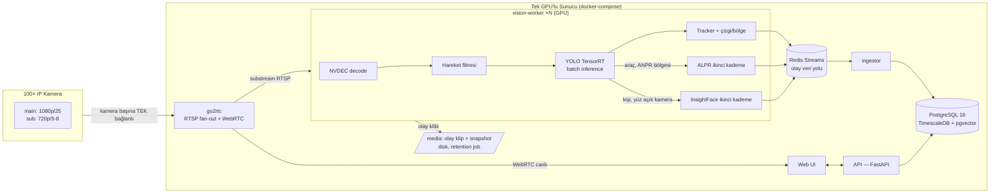

# AurasVision — 100 Kameralık Üretim Mimarisi

> Hedef: **tek güçlü GPU'lu makinede ~100 kameraya kadar** kişi sayma + plaka (ANPR) + anonim yüz demografisi;
> tüm sonuçlar **veritabanı seviyesinde** kalıcı; **ayarlar basit** (tek config + web arayüzü).
> Bu belge global çözümlerin (Frigate, DeepStream/Savant, go2rtc, Timescale/ClickHouse) incelenmesine dayanır.
> POC → üretim yol haritası en sonda.

---

## 1. Global çözümlerden ne öğrendik, ne alıyoruz

| Çözüm | Ne yapıyor | Bizim aldığımız ders |
|---|---|---|
| **Frigate NVR** (açık kaynak referans) | go2rtc ile RTSP fan-out, hareket filtresi → sadece hareketli bölgede AI, SQLite + medya retention, tek YAML config | **Substream'de analiz** (720p/5fps), **hareket ön-filtresi**, **tek dosyalık basit config**, medya saklama = sadece olay klipi |
| **go2rtc** | Kameraya tek bağlantı, WebRTC/RTSP/MSE olarak çoğaltma | Canlı izleme ile analiz **aynı kamera bağlantısını paylaşır**; kamera başına tek TCP oturumu |
| **NVIDIA DeepStream** | GStreamer tabanlı çok-akışlı GPU pipeline; decode (NVDEC) → batch inference (TensorRT) → tracker, tümü GPU'da | 100 kamera tek GPU'da ancak **batched TensorRT + NVDEC** ile olur; kare CPU'ya inmez |
| **Savant** | DeepStream'in Python-first sarmalayıcısı; aylarca GStreamer mühendisliğini kısaltır | Faz 2'de DeepStream'i çıplak yazmak yerine **Savant** kullan |
| **Milestone/Genetec** (ticari UI referansı) | Kamera duvarı, olay zaman çizelgesi, izleme listeleri, kural motoru | UI kavram seti: canlı duvar · olay akışı · uyarı kuralları · kamera başına görev aç/kapa |
| **TimescaleDB vs ClickHouse** | Timescale = Postgres uzantısı (ilişkisel + zaman serisi + pgvector aynı DB'de); ClickHouse = devasa aggregasyonda 6-7× hızlı ama ayrı sistem | 100 kamera ölçeğinde (≤ ~50M olay/yıl) **tek PostgreSQL + TimescaleDB + pgvector** yeter — işletmesi basit. ClickHouse ancak 1000+ kamera / milyarlarca satırda gündeme gelir |

**Karar özeti:** Frigate'in *işletme basitliği* + DeepStream/Savant'ın *GPU verimi* + tek Postgres'in *veri bütünlüğü*.

---

## 2. Mimari — kuş bakışı



### Katmanlar

1. **Ingest — go2rtc.** Her kameraya tek bağlantı; analiz worker'ları ve tarayıcıdaki canlı görüntü aynı akıştan beslenir. Kamera tanımı DB'de, go2rtc config'i API tarafından üretilir (kullanıcı YAML elle düzenlemez).
2. **Analiz — vision-worker.** GPU'da uçtan uca: NVDEC decode → (hareket yoksa atla) → tek YOLO modeliyle **tüm kameraların kareleri tek batch'te** inference → kamera başına tracker → çizgi/bölge mantığı. Plaka OCR ve yüz analizi **birinci kademenin tetiklediği ikinci kademe**dir: her karede değil, yalnızca "ANPR bölgesinde araç var" / "yüz görevi açık kamerada kişi var" olduğunda çalışır. GPU bütçesinin 100 kameraya yetmesinin sırrı budur.
3. **Olay veri yolu — Redis Streams.** Worker'lar olayları JSON olarak `events:*` stream'ine yazar; ingestor toplu (batch) olarak DB'ye basar. Worker çökse bile stream'de bekleyen olay kaybolmaz. (Ek broker yok; Redis aynı zamanda cache + iş kuyruğu.)
4. **Veri — PostgreSQL + TimescaleDB + pgvector.** Tek veritabanında üç iş: ilişkisel yapı (kamera/bölge/liste), zaman serisi olaylar (hypertable + sıkıştırma + retention), yüz embedding araması (pgvector). Şema §4'te.
5. **Medya.** Ham akış **saklanmaz** (KVKK + disk). Yalnızca olay anının snapshot'ı ve isteğe bağlı ±5 sn klip; retention job süresi dolanı siler. NVR kaydı gerekirse Frigate/go2rtc yan yana kurulur — analiz platformunun işi değil.
6. **API + UI.** Mevcut FastAPI + tek sayfa UI büyütülür: canlı duvar (go2rtc WebRTC), kamera yönetimi, bölge editörü (mevcut), olay akışı, izleme listeleri, **kamera başına görev anahtarı** (sayım/plaka/yüz aç-kapa) ve dashboard (Timescale continuous aggregate'lerden).

---

## 3. Kapasite: 100 kamera tek GPU'ya sığar mı?

Hesap yöntemi = **FPS bütçesi** (NVIDIA'nın DeepStream performans tablolarındaki yaklaşım):

- Analiz **substream** üzerinde: 720p @ **5 fps** (sayım için yeterli; Frigate varsayılanı da bu banttadır).
- Gerekli inference: 100 kamera × 5 fps = **500 kare/sn**. Hareket filtresi gerçek yükü tipik sahnede %30-60 düşürür.
- Modern bir GPU'da (L4 / L40S / RTX 4090-5090 sınıfı) TensorRT'ye çevrilmiş küçük bir tespit modeli batch'li çalışırken **600-1500+ FPS** verir (NVIDIA, PeopleNet için L40S'te ~724 FPS raporluyor; YOLO11s-TRT benzer bant). → Birinci kademe tek GPU'ya sığar.
- **Decode dar boğazı:** NVDEC birimi başına kabaca 25-40 adet 1080p/25 akış çözülür; 100 kamerada bu yüzden **substream (720p/5-8fps) zorunlu**, main stream'e yalnız canlı izlemede dokunulur.
- İkinci kademe (ALPR + yüz) olay-tetikli olduğundan bütçesi küçüktür; ikisi de TensorRT/ONNX-GPU'ya alınır (POC'taki CPU-provider kalkar).

**Donanım önerisi (tek makine):**

| Senaryo | GPU | Not |
|---|---|---|
| 100 kam sayım + ~10 kam ANPR + ~10 kam yüz | 1× **L4** (düşük güç, 2 NVDEC) veya 1× **RTX 4090/5090** | hedef konfigürasyon |
| 100 kamda üçü birden yoğun | 2× GPU veya 1× L40S | worker'lar GPU'lara bölünür |
| CPU/RAM | 16+ çekirdek, 64-128 GB | decode-yardımcı + Postgres + Redis aynı makinede |
| Disk | NVMe 2 TB+ | DB ayrı volume; olay medyası ayrı, retention'lı |

> Devreye alırken ilk iş: hedef donanımda 10-20 gerçek kamerayla FPS bütçesini **ölç**, kamera/worker oranını ona göre sabitle.

**Test makinesi — FusionXpark GB10 (NVIDIA DGX Spark OEM'i):**
GB10 Grace Blackwell Superchip = 20 çekirdek ARM **Grace CPU + Blackwell GPU**, 128 GB birleşik bellek.
Mimari sonuçları:
- **aarch64 (ARM64):** tüm Docker imajları multi-arch seçildi (pgvector/pgvector, redis, timescale deb'i arm64 mevcut). PyTorch/TensorRT arm64 CUDA wheel'leri DGX OS ile geliyor.
- **Inference bütçesi geniş** (Blackwell + 128 GB birleşik bellek), asıl sınır **NVDEC sayısı** → 100 kamerada substream (720p/5fps) katı kural; gerekirse Grace çekirdekleri CPU-decode yardımcısı olur.
- Birleşik bellek, DB + Redis + worker'ın aynı makinede rahat çalışmasına izin verir; büyük batch inference için ayrı VRAM sınırı yok.
- DeepStream/Savant'ın Jetson (aarch64) desteği olgun; Faz 3 bu makinede doğrudan denenebilir.

---

## 4. Veri modeli (PostgreSQL + TimescaleDB + pgvector)

İlkeler: olay tabloları **hypertable** (zaman bölümlemeli), 7 günden eskisi sıkıştırılır, ham olay 90 gün sonra silinir; rapor ihtiyacı **continuous aggregate**'lerde (15 dk özet) 2 yıl yaşar. Ham görüntü DB'ye girmez; yüz için yalnız 512d vektör (KVKK).

```sql
CREATE EXTENSION IF NOT EXISTS timescaledb;
CREATE EXTENSION IF NOT EXISTS vector;

-- ── Yapı tabloları (ilişkisel, küçük) ─────────────────────────────
CREATE TABLE cameras (
    id          TEXT PRIMARY KEY,             -- slug: "giris-kapisi"
    name        TEXT NOT NULL,
    url_main    TEXT NOT NULL,                -- rtsp://... (şifre env/secret'tan şablonlanır)
    url_sub     TEXT,                         -- analiz akışı; yoksa main'den ölçekle
    enabled     BOOLEAN NOT NULL DEFAULT true,
    tasks       JSONB NOT NULL DEFAULT '{"count":true,"plate":false,"face":false}',
    detect_fps  SMALLINT NOT NULL DEFAULT 5,
    retention_days SMALLINT NOT NULL DEFAULT 90,
    created_at  TIMESTAMPTZ NOT NULL DEFAULT now()
);

CREATE TABLE zones (
    id          BIGINT GENERATED ALWAYS AS IDENTITY PRIMARY KEY,
    camera_id   TEXT NOT NULL REFERENCES cameras(id) ON DELETE CASCADE,
    kind        TEXT NOT NULL CHECK (kind IN ('line','zone','intrusion')),
    name        TEXT NOT NULL,
    points      JSONB NOT NULL,               -- [[x,y],...] normalize 0-1
    classes     TEXT[] NOT NULL DEFAULT '{person}',
    direction   TEXT,                         -- line: 'AtoB' | 'BtoA' | 'both'  ← sayımda UYGULANIR
    created_at  TIMESTAMPTZ NOT NULL DEFAULT now()
);

CREATE TABLE watch_plates (
    id          BIGINT GENERATED ALWAYS AS IDENTITY PRIMARY KEY,
    plate       TEXT NOT NULL UNIQUE,         -- normalize: boşluksuz, büyük harf
    label       TEXT,
    list_type   TEXT NOT NULL DEFAULT 'blacklist',
    created_at  TIMESTAMPTZ NOT NULL DEFAULT now()
);

CREATE TABLE watch_faces (
    id          BIGINT GENERATED ALWAYS AS IDENTITY PRIMARY KEY,
    name        TEXT NOT NULL,
    label       TEXT,
    list_type   TEXT NOT NULL DEFAULT 'blacklist',
    embedding   VECTOR(512),                  -- ArcFace; ham görüntü YOK (KVKK)
    created_at  TIMESTAMPTZ NOT NULL DEFAULT now()
);
CREATE INDEX ON watch_faces USING hnsw (embedding vector_cosine_ops);

-- ── Olay tabloları (hypertable, yüksek hacim) ─────────────────────
-- Geçiş olayları: track çizgiyi her geçişte 1 satır (yön bazlı; ömür-boyu-tek-sayım yok)
CREATE TABLE count_events (
    time        TIMESTAMPTZ NOT NULL,
    camera_id   TEXT NOT NULL,
    zone_id     BIGINT,
    track_id    BIGINT NOT NULL,              -- worker'ın atadığı akış-içi id
    direction   TEXT NOT NULL,                -- 'in' | 'out'
    class       TEXT NOT NULL DEFAULT 'person',
    conf        REAL
);
SELECT create_hypertable('count_events','time');

-- Plaka: TRACK bazlı tek satır (kareler arası oylama worker'da biter)
CREATE TABLE plate_events (
    time        TIMESTAMPTZ NOT NULL,
    camera_id   TEXT NOT NULL,
    track_id    BIGINT,
    plate       TEXT NOT NULL,
    conf        REAL,
    reads       SMALLINT,                     -- oylamaya giren kare sayısı
    snapshot    TEXT                          -- /media altında dosya (retention'a tabi)
);
SELECT create_hypertable('plate_events','time');

-- Yüz: track bazlı tek satır (kare başına değil → mükerrer demografi biter)
CREATE TABLE face_events (
    time        TIMESTAMPTZ NOT NULL,
    camera_id   TEXT NOT NULL,
    track_id    BIGINT,
    age         SMALLINT,
    gender      CHAR(1),                      -- 'M' | 'F'
    conf        REAL,
    match_name  TEXT,                         -- izleme listesi eşleşmesi (varsa)
    match_score REAL
);
SELECT create_hypertable('face_events','time');

CREATE TABLE alerts (
    time        TIMESTAMPTZ NOT NULL,
    camera_id   TEXT NOT NULL,
    kind        TEXT NOT NULL,                -- 'plate' | 'face' | 'intrusion'
    ref         TEXT NOT NULL,
    list_type   TEXT,
    label       TEXT,
    acked_by    TEXT,
    acked_at    TIMESTAMPTZ
);
SELECT create_hypertable('alerts','time');

-- Kamera sağlığı (worker heartbeat → panelde 'online/offline' gerçek olur)
CREATE TABLE camera_health (
    time        TIMESTAMPTZ NOT NULL,
    camera_id   TEXT NOT NULL,
    fps         REAL, dropped BIGINT, status TEXT   -- ok | no_signal | decode_err
);
SELECT create_hypertable('camera_health','time');

-- ── Sıkıştırma + saklama politikaları ─────────────────────────────
ALTER TABLE count_events SET (timescaledb.compress,
    timescaledb.compress_segmentby='camera_id');
SELECT add_compression_policy('count_events', INTERVAL '7 days');
SELECT add_retention_policy ('count_events', INTERVAL '90 days');
-- (plate_events / face_events / camera_health için aynı kalıp;
--  alerts sıkıştırılır ama silinmez.)

-- ── Rapor: 15 dakikalık özet (dashboard buradan okur, ham tabloya inmez) ──
CREATE MATERIALIZED VIEW occupancy_15m
WITH (timescaledb.continuous) AS
SELECT time_bucket('15 minutes', time) AS bucket,
       camera_id,
       count(*) FILTER (WHERE direction='in')  AS in_count,
       count(*) FILTER (WHERE direction='out') AS out_count
FROM count_events GROUP BY bucket, camera_id;
SELECT add_continuous_aggregate_policy('occupancy_15m',
    start_offset => INTERVAL '1 hour', end_offset => INTERVAL '1 minute',
    schedule_interval => INTERVAL '5 minutes');
-- Özet 2 yıl saklanır → ham 90 günde silinse de rapor kaybolmaz.
```

POC'a göre kritik farklar:
- **Kare-bazlı değil track-bazlı olay.** Yüz ve plaka, track kapanınca *tek* satır yazar (oylama/tekilleştirme worker'da). DB hacmi ~50× düşer, sayılar "kişi/araç" anlamına gelir.
- **`direction` artık uygulanıyor**; ömür-boyu-tek-sayım kalkıp geçiş-başına-sayım + cooldown geliyor (içerideki kişi = in − out hesaplanabilir).
- **`synced` bayrağı kalktı** — tek merkezi DB var; edge senaryosu gelirse ayrı store-and-forward katmanı eklenir.
- Uyarılara **ack** (görüldü) alanı — operatör akışı için.

---

## 5. "Basit ayarlar" tasarımı

Frigate dersinin uygulanışı — iki seviye, fazlası yok:

1. **`config.yaml` = yalnızca sistem varsayılanları** (bir kez kurulur, nadiren dokunulur):

```yaml
device: cuda
detect:  { model: yolo11s.engine, fps: 5, conf: 0.35 }   # tüm kameralar için varsayılan
plate:   { min_conf: 0.4 }
face:    { model_pack: buffalo_l, match_threshold: 0.5 }
storage: { media_dir: /media, event_clip: false, snapshot: true }
db:      { url: env:DATABASE_URL }          # şifreler daima env/secret, YAML'a yazılmaz
```

2. **Geri kalan her şey UI'dan → DB'ye:** kamera ekleme (ad + RTSP adresi, iki alan), görev anahtarları (sayım/plaka/yüz), bölge çizimi, izleme listeleri, saklama süresi. Kamera başına özel eşik gerekiyorsa `cameras.tasks` JSONB'de override — ayrı dosya, ayrı ekran yok.

Kural: **kullanıcının elle düzenlediği tek dosya `config.yaml`; onun da içinde 15 satırdan az ayar.** go2rtc config'i ve worker atamaları API tarafından otomatik üretilir.

---

## 6. Dağıtım — docker-compose (tek makine)

```yaml
services:
  go2rtc:    # kamera ingest + WebRTC canlı izleme
  worker:    # vision-worker (GPU; deploy.resources.reservations: gpu)
             # ölçek: worker'a kamera aralığı ata (worker başına ~25-50 kam)
  redis:     # olay veri yolu + cache
  db:        # timescale/timescaledb-ha:pg16 (timescaledb + pgvector içerir)
  api:       # FastAPI + UI (statik) + ingestor
  retention: # medya temizlik cron'u (DB tarafını Timescale politikaları yapar)
```

- Tek `docker compose up -d` ile kurulum; GPU için `nvidia-container-toolkit`.
- Yedekleme: gece `pg_dump` + medya dizini rsync. İzleme: `camera_health` tablosu UI'da; istenirse Prometheus/Grafana sonradan takılır (zorunlu değil — basitlik).
- Güvenlik (POC bulgularının kapanışı): API'ye kullanıcı/oturum (en az tek admin + token), UI'da tüm değerlere escape, RTSP şifreleri secret'ta, sunucu LAN'da/VPN arkasında.

---

## 7. Yol haritası — POC'tan 100 kameraya

| Faz | Kapsam | Çıktı |
|---|---|---|
| **Faz 1 — Veri katmanı** (mevcut kodla) | SQLite → **Postgres+Timescale+pgvector** (şema §4), store.py yerine ince repo katmanı; track-bazlı olay; `direction` uygulaması; API auth + XSS düzeltmeleri | Aynı UI, doğru veri modeli; 1-5 kamera |
| **Faz 2 — Servis ayrımı** | go2rtc ekle; analiz API sürecinden çıkıp **worker** olur (Redis Streams); kamera başına görev anahtarı; camera_health; docker-compose | 10-25 kamera, GPU'suz/tek GPU makinede sürekli çalışma |
| **Faz 3 — GPU pipeline** | Worker içi motor değişimi: Ultralytics-PyTorch → **Savant (DeepStream) + TensorRT** engine'ler; ALPR & yüz ONNX-GPU; hareket filtresi; batch inference | Hedef donanımda **100 kamera**; kamera/GPU oranı ölçümle sabitlenir |
| **Faz 4 — Operasyon** | Dashboard (continuous aggregate), uyarı ack akışı, bildirim (webhook/e-posta), yedekleme runbook'u | Sahaya devir |

Kritik sıra notu: **Faz 1 önce** — veri modeli doğru olmadan pipeline hızlandırmanın anlamı yok; Faz 3'te motor değişse de olay şeması ve UI aynı kalır (worker'ın DB'ye değil Redis'e yazması bu ayrımı garanti eder).

---

## Kaynaklar

- Frigate mimarisi & go2rtc: [docs.frigate.video](https://docs.frigate.video/guides/configuring_go2rtc/) · [DeepWiki: frigate](https://deepwiki.com/blakeblackshear/frigate)
- DeepStream performans (FPS bütçesi): [NVIDIA DS_Performance](https://docs.nvidia.com/metropolis/deepstream/dev-guide/text/DS_Performance.html)
- Savant (DeepStream'in Python çatısı): [savant-ai.io](https://savant-ai.io/) · [GitHub insight-platform/Savant](https://github.com/insight-platform/Savant)
- Timescale vs ClickHouse karşılaştırmaları: [tinybird.co](https://www.tinybird.co/blog/clickhouse-vs-timescaledb) · [oneuptime.com](https://oneuptime.com/blog/post/2026-01-21-clickhouse-vs-timescaledb/view)
